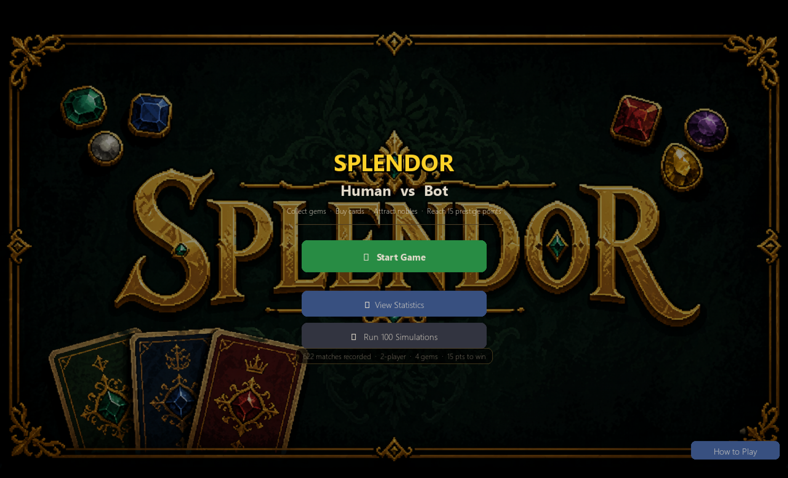
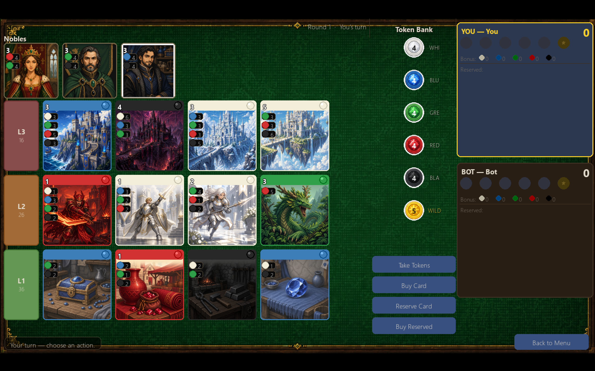
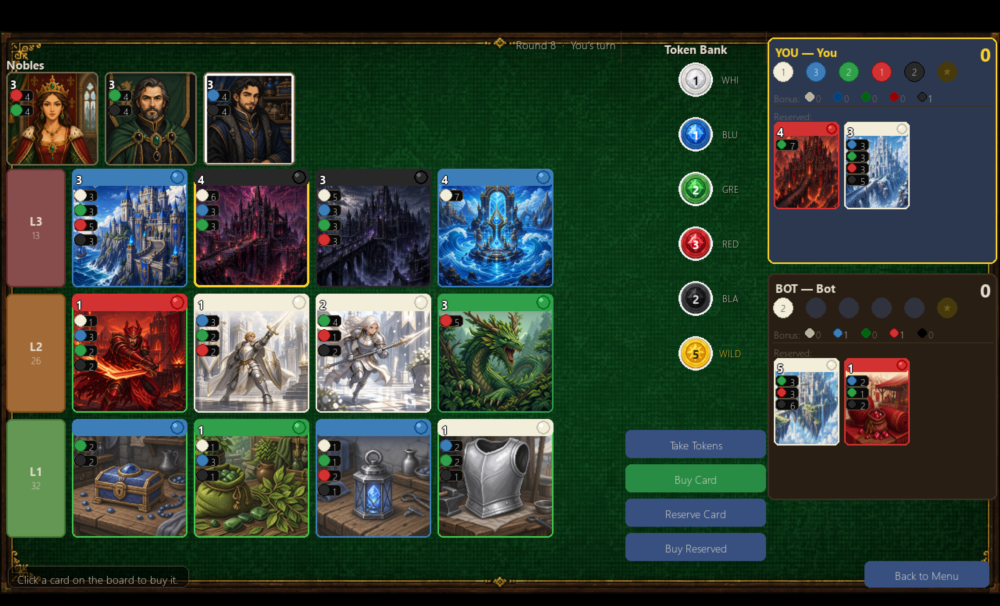
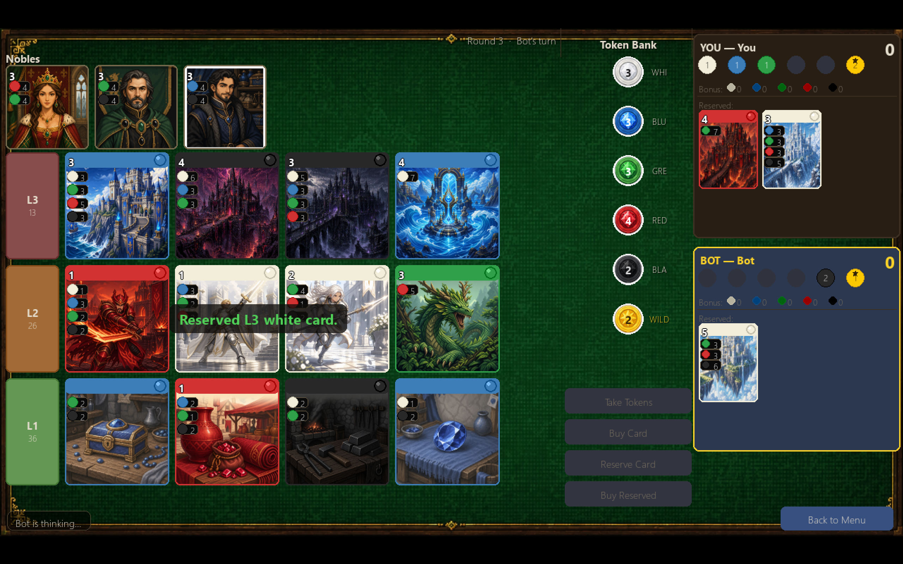
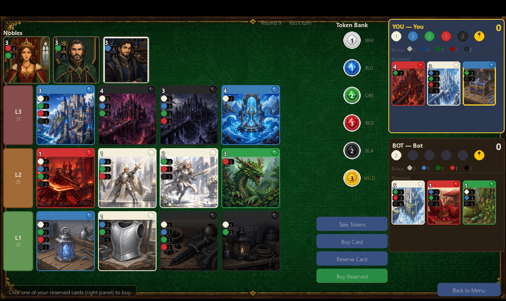
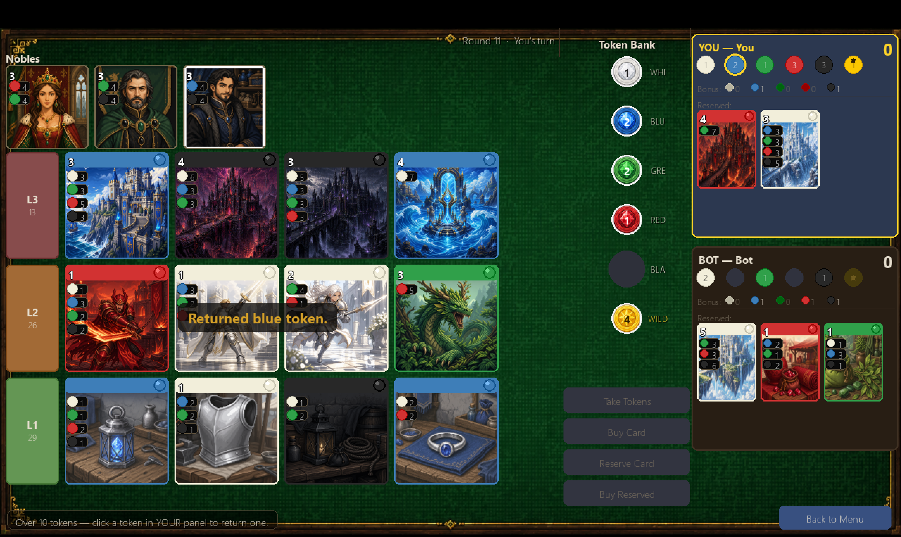
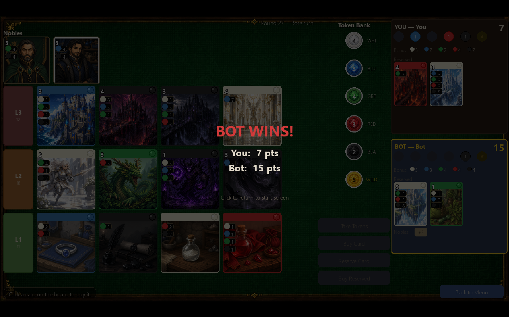
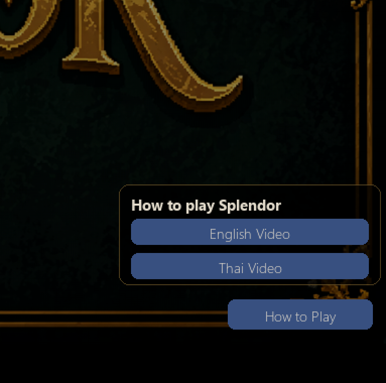
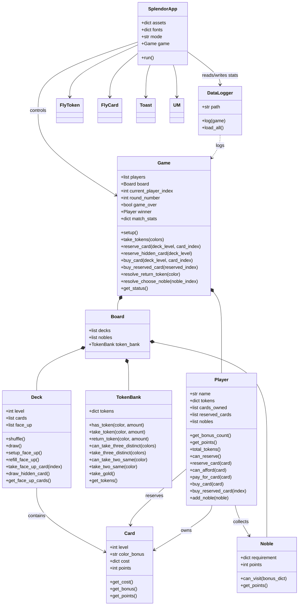

# Project Description

## 1. Project Overview

- **Project Name:**  
  Splendor game

- **Brief Description:**  
  This project is a digital adaptation of the board game *Splendor*, implemented in Python with Pygame. It allows a human player to play against an AI bot in a two-player match while preserving the core rules of the original game: collecting gem tokens, purchasing development cards, attracting nobles, and racing to 15 prestige points.

  In addition to the main game, the project includes a built-in statistics system. Match results can be logged to CSV, simulated through automated bot-versus-bot games, and visualized through an in-game dashboard. This makes the project both an interactive game and a small data-analysis application.

- **Problem Statement:**  
  The project solves two related problems. First, it provides a playable digital version of *Splendor* for users who want to enjoy the game without setting up the physical board. Second, it helps players analyze gameplay patterns by recording match data and presenting summaries such as gem collection, tier purchases, score margins, gold usage, and match length.

- **Target Users:**  
  - Students learning object-oriented programming through a game-based project
  - Players who want to play *Splendor* against a computer opponent
  - Users interested in simulation and gameplay statistics
  - Instructors or reviewers who want to inspect class design and rule implementation

- **Key Features:**  
  - Full two-player *Splendor* gameplay with rule validation
  - Human vs Bot mode with a heuristic-based AI opponent
  - Bot vs Bot simulation mode for batch testing
  - Persistent match logging to CSV
  - In-game statistics dashboard with multiple charts and tables
  - Custom fantasy-themed artwork for cards, nobles, tokens, and menu screens

### Screenshots

**Game Menu**  

**Start Game**  

**Buy Card**  

**Reserve Card**  

**Buy Reserved Card**  

**Return Token**  

**End Game**  

**Tutorial Button**  

### Proposal

- Proposal PDF: [proposal.pdf](./proposal.pdf)

### Presentation Video

- YouTube presentation link: `[Add your 7-minute presentation here](https://www.youtube.com/)`

The presentation should include:
- A short introduction and demonstration of both the game and the statistics system
- An explanation of the class design and how the classes are used together
- An explanation of the recorded statistics and data visualization

---

## 2. Concept

### 2.1 Background

This project exists because board games are an excellent way to practice object-oriented programming. *Splendor* has a clear rule system, several interacting game objects, and meaningful state transitions, which make it a strong case study for class design, composition, and rule enforcement.

The project was inspired by the original *Splendor* board game and by the idea of combining a playable game with post-game analysis. Instead of only recreating the board game, the system also records data from every match and presents it visually inside the application. This adds educational value because it connects game programming with data collection and visualization.

The problem is important because game projects are often judged only by whether they are playable. In this project, the goal is broader: to show that a well-structured software system can support gameplay, AI decision-making, simulation, persistent records, and statistics dashboards in one integrated application.

### 2.2 Objectives

- Implement a rule-correct two-player *Splendor* game in Python
- Design the system using object-oriented principles with clear class responsibilities
- Support human-versus-bot play in a responsive GUI
- Create an AI bot that can make practical decisions instead of random moves
- Record match outcomes and gameplay features automatically
- Visualize recorded data in a way that helps users understand how games evolve
- Demonstrate software design, data handling, and user interface development in one project

---

## 3. UML Class Diagram

### UML PDF Attachment

- UML Class Diagram PDF: [UML PDF](./uml.pdf)

### UML Preview (Mermaid)

---

## 4. Object-Oriented Programming Implementation

The project applies object-oriented programming by separating the game into small, focused classes. Each class has a clear responsibility and collaborates with the others through composition rather than putting all logic into one file.

- **Card:** Represents one development card, including tier, permanent bonus color, purchase cost, and prestige points.
- **Noble:** Represents a noble tile and checks whether a player has enough permanent bonuses to claim it.
- **Deck:** Manages one level of development cards, including hidden cards and face-up cards on the board.
- **TokenBank:** Stores the shared token supply and validates token-taking rules.
- **Player:** Stores each player's tokens, purchased cards, reserved cards, nobles, and payment logic.
- **Board:** Groups the shared resources of a match, including decks, nobles, and the token bank.
- **Game:** Acts as the main rules engine. It validates actions, controls turns, handles pending states, awards nobles, tracks match statistics, and determines the winner.
- **DataLogger:** Writes completed match summaries to `stats/match_log.csv` and reloads historical data for the dashboard.
- **SplendorApp:** Controls the Pygame application, screen states, rendering, input handling, bot turns, simulation triggers, and transitions between menu, gameplay, and statistics screens.
- **FlyToken:** Handles token movement animation after token-taking actions.
- **FlyCard:** Handles simple card animation effects in the interface.
- **Toast:** Displays temporary on-screen feedback messages.
- **UM:** Stores UI mode constants used by the application state machine.

The project also includes supporting function-based modules:

- **`bot.py`:** Heuristic AI behavior for the bot player
- **`bot_sim.py`:** Batch simulation runner for bot-versus-bot matches
- **`stats_view.py`:** In-game Pygame dashboard rendering with Matplotlib
- **`game_factory.py`:** Factory function that assembles a ready-to-play game
- **`cards_data.py`:** Raw card and noble definitions used to build the board

---

## 5. Statistical Data

### 5.1 Data Recording Method

Match data is recorded automatically at the end of each completed game through the `DataLogger` class. The logger appends one row per match to `stats/match_log.csv`. The system supports both manually played Human vs Bot matches and automated Bot vs Bot simulations.

Each row stores summary information about the match, including:

- Match ID and timestamp
- Total number of turns
- Winner name
- Winner score, loser score, and score margin
- Per-player gold token usage
- Per-player number of purchased cards by tier
- Per-player gem collection totals by color

The `Game` class prepares `match_stats` during gameplay, and `DataLogger` converts those in-memory statistics into a persistent CSV record.

### 5.2 Data Features

The recorded data is structured, numeric, and match-based. It supports summary analysis, comparison between players, and repeated simulation experiments.

Key data features include:

- **Turn count:** Measures how long each match lasts
- **Winner and score margin:** Shows match competitiveness
- **Tier purchases:** Indicates strategic preference for low-, mid-, or high-tier cards
- **Gem collection by color:** Shows resource demand across matches
- **Gold spent:** Helps measure how often wildcard tokens contribute to successful purchases
- **Repeated simulation support:** Makes it possible to analyze trends over many bot-played matches

The statistics are visualized through the in-game dashboard in `stats_view.py`, including:

- Gem collection charts and tables
- Tier purchase charts and tables
- Score margin distribution
- Turns-per-match histogram and summary table
- Gold usage vs margin score summary table and scatter plot

Detailed screenshot evidence and one-paragraph explanations for each visualization component are included in `screenshots/visualization/VISUALIZATION.md`.

---

## 6. Changed Proposed Features

The visualization part was changed from showing coin usage between Bot 1 and Bot 2 using a pie chart to showing the relationship between gold spent and score margin using a scatter plot.

The bot implementation was also changed. Instead of creating bots with multiple difficulty levels, the project scope was reduced to only one hard-level bot.

---

## 7. External Sources

The project uses the following external libraries and technologies:

- **Pygame**  
  Used for the main game window, rendering, input handling, and animation  
  Source: https://www.pygame.org/  
  License: LGPL

- **Matplotlib**  
  Used for rendering the statistics dashboard charts and tables  
  Source: https://matplotlib.org/  
  License: Matplotlib License

- **Python Standard Library**  
  Modules such as `csv`, `datetime`, `math`, `os`, `random`, `sys`, `threading`, and `traceback` are used throughout the project  
  Source: https://docs.python.org/3/library/

### Artwork and Media Credits

This project is a fan-made educational recreation of the Splendor board game using Pygame.

Splendor is a copyrighted board game originally designed by Marc André and published by Space Cowboys / Asmodee. All original game concepts, rules, names, and related intellectual property belong to their respective owners.

The visual assets used in this project were created using ChatGPT image generation, including:

Card component images
Background image
Coin/token images

No third-party artwork, music, or sound effects were used. This project is made for educational purposes only and is not intended for commercial use.

### Tutorial Video References and Copyright

The start screen includes optional links to external YouTube tutorial videos for players who want to learn the rules of *Splendor*. These videos are not included, copied, downloaded, or redistributed in this repository. They remain the copyrighted property of their respective creators on YouTube, and this project only provides external reference links for educational and gameplay guidance.

- **Asset/Material:** Splendor tutorial video (English)  
- **Creator / Source:** YouTube creator / original uploader  
- **Link:** https://youtu.be/rue8-jvbc9I?si=TfT2SNTgTbRNzR7f  
- **License / Permission:** External reference link only; copyright remains with the original creator

- **Asset/Material:** Splendor tutorial video (Thai)  
- **Creator / Source:** YouTube creator / original uploader  
- **Link:** https://youtu.be/C-ZkrifmcOg?si=GCs8B34I-2TOsIeY  
- **License / Permission:** External reference link only; copyright remains with the original creator

### GitHub Contributor Note

On GitHub, `Claude` may appear in the contributor or commit history view because some earlier commits were created with a `Co-Authored-By: Claude ...` footer when Claude was used to help produce commit messages or commit metadata. This does not mean Claude is an official team member or project owner; it only reflects how those earlier commits were recorded in Git history.

