# Data Visualization Screenshots

This folder contains the screenshots and explanations for all data-related parts of the project. The screenshots are grouped into overview screenshots for each visualization page and individual screenshots for each graph or table component.

## Screenshot Checklist

Overall page screenshots:
- `page1_resources_overview.png`
- `page2_outcomes_overview.png`
- `page3_gold_analysis_overview.png`

Component screenshots for the `Resources` page:
- `resources_gem_chart.png`
- `resources_tier_chart.png`
- `resources_gem_table.png`
- `resources_tier_table.png`

Component screenshots for the `Outcomes` page:
- `outcomes_margin_boxplot.png`
- `outcomes_turns_histogram.png`
- `outcomes_margin_table.png`
- `outcomes_turns_table.png`

Component screenshots for the `Gold Analysis` page:
- `gold_summary_table.png`
- `gold_scatter_plot.png`

## Page Overviews

### 1. Resources Page Overview

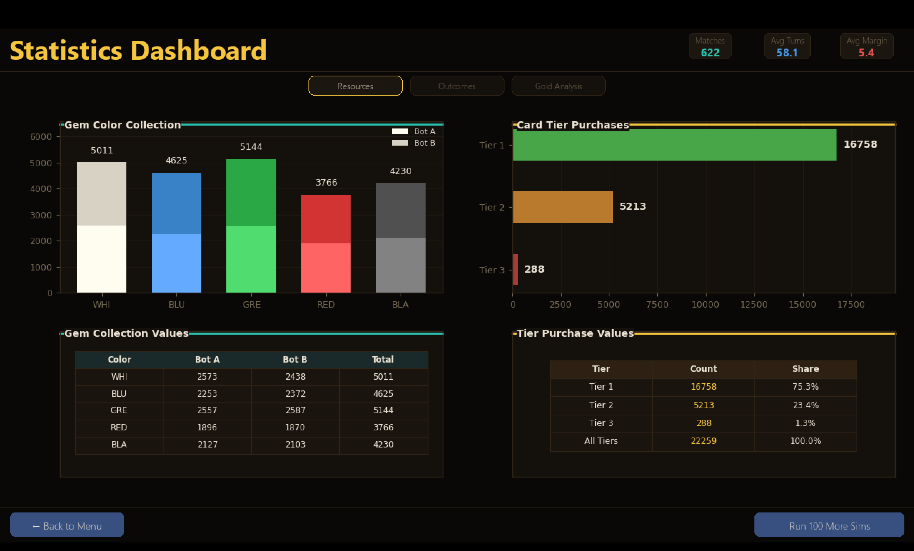

This screenshot shows the overall layout of the `Resources` page in the statistics dashboard. It combines gem collection and tier purchase visualizations in a single page so the user can quickly compare how resources were collected and how cards were purchased across simulated matches.

### 2. Outcomes Page Overview

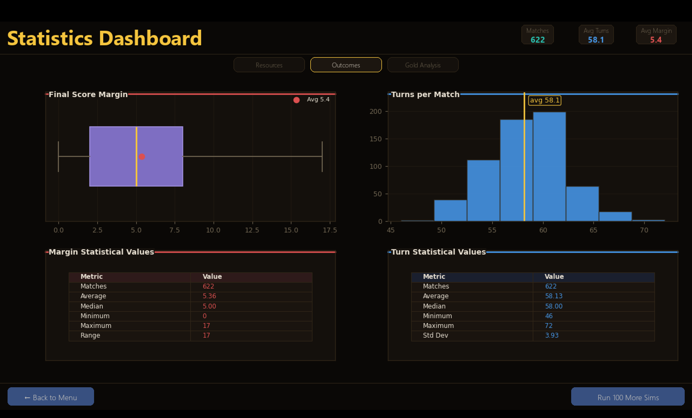

This screenshot shows the overall layout of the `Outcomes` page. The page focuses on match results by summarizing score margin and total turns, allowing the viewer to understand how long games usually last and how close or one-sided the results tend to be.

### 3. Gold Analysis Page Overview

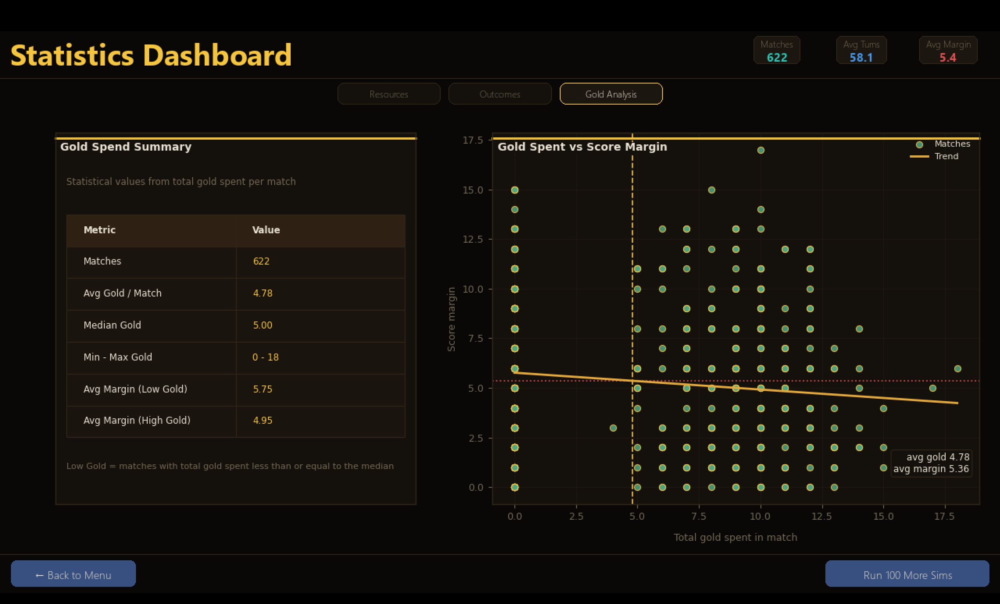

This screenshot shows the overall layout of the `Gold Analysis` page. It highlights how gold token spending relates to score margin, combining a summary table with a scatter plot to support both quick reading and deeper comparison.

## Resources Page Components

### 4. Gem Collection Chart

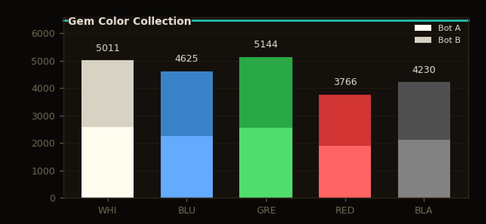

This chart visualizes gem collection by color across recorded matches. It helps show which gem colors are gathered most often and makes it easier to compare the resource-collection patterns of the two competing players or bots.

### 5. Tier Purchase Chart

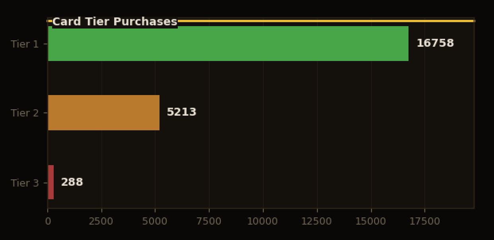

This chart shows how many cards were purchased from each tier. It helps explain the progression of gameplay because lower-tier cards usually support early development while higher-tier cards represent stronger late-game investments.

### 6. Gem Collection Table

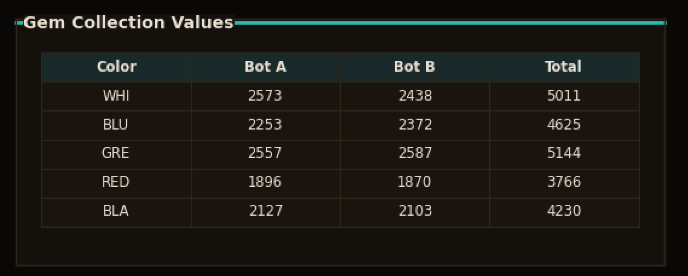

This table provides the numeric values behind the gem collection chart. It is useful because it presents exact totals for each gem color, making the chart easier to verify and giving a more precise summary of resource usage.

### 7. Tier Purchase Table

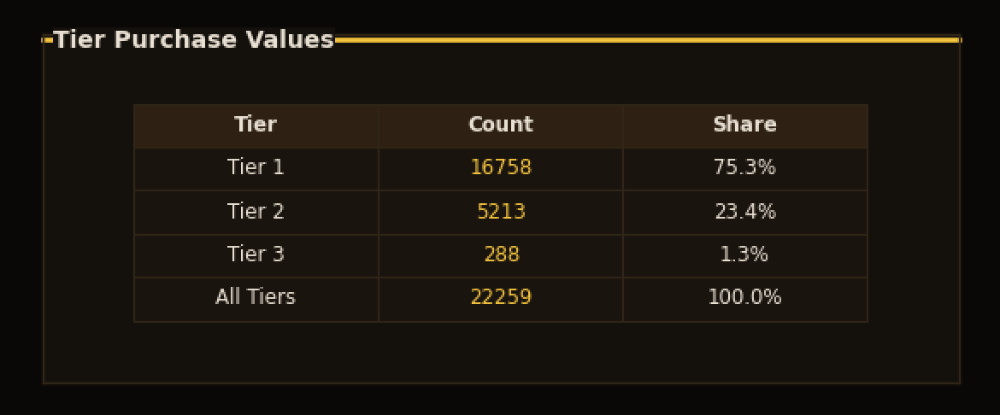

This table summarizes the number and share of purchased cards in each tier. It supports the chart by giving exact counts and percentages, which helps explain which card tier appears most frequently in the recorded matches.

## Outcomes Page Components

### 8. Score Margin Boxplot

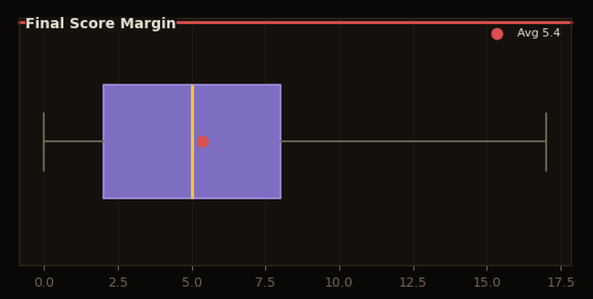

This boxplot visualizes the distribution of score margins between the winner and loser. It helps the viewer understand spread, typical range, and outliers, which together show whether matches are usually close or have large winning gaps.

### 9. Turns per Match Histogram

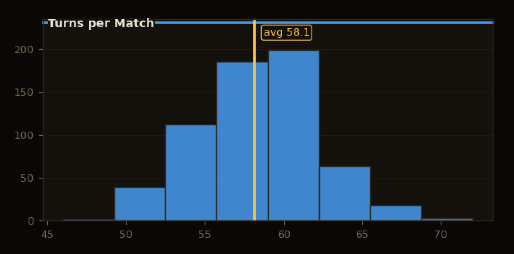

This histogram shows how many turns matches usually take. It is useful for identifying the most common match length and for checking whether games tend to end quickly, cluster around a middle range, or occasionally last much longer.

### 10. Margin Statistics Table

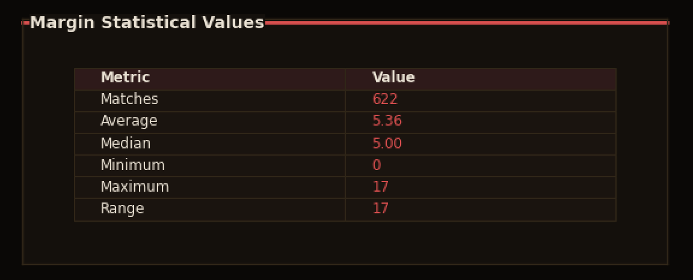

This table gives a direct numerical summary of score margins, including overall match count and central values. It complements the boxplot by making the distribution easier to interpret with exact numbers.

### 11. Turn Statistics Table

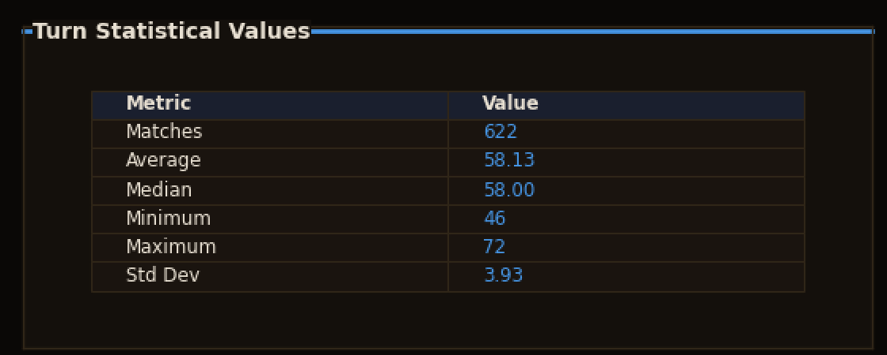

This table summarizes the number of turns per match using exact values. It supports the histogram by showing readable statistics that help explain overall pacing and consistency of gameplay.

## Gold Analysis Components

### 12. Gold Spend Summary Table

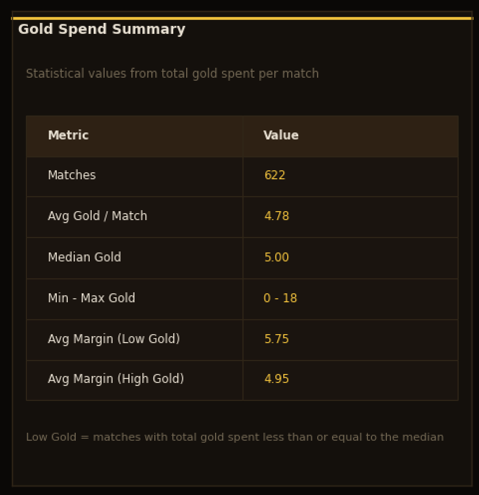

This table summarizes total gold spending per match and compares score margins between lower-gold and higher-gold groups. It helps the reader quickly understand how often gold is used and whether spending patterns appear to relate to match outcomes.

### 13. Gold Spent vs Score Margin Scatter Plot

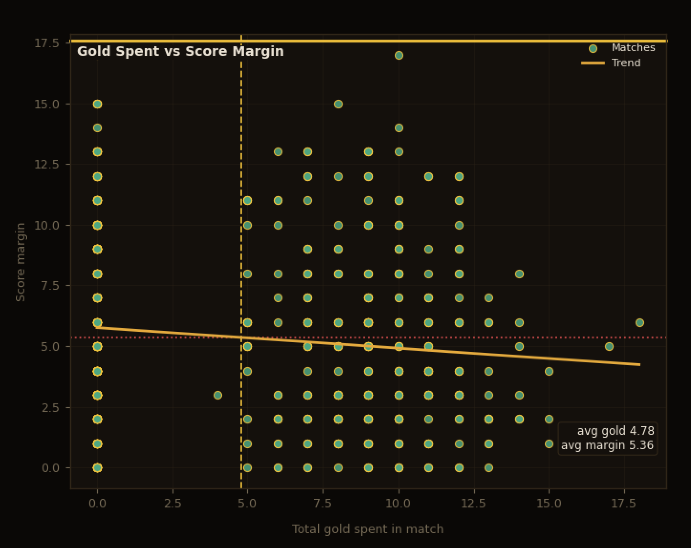

This scatter plot compares total gold spent in a match against the final score margin. It is useful for spotting patterns, clusters, and possible trends between gold usage and match results, while the trend line helps show the overall direction of the relationship.

